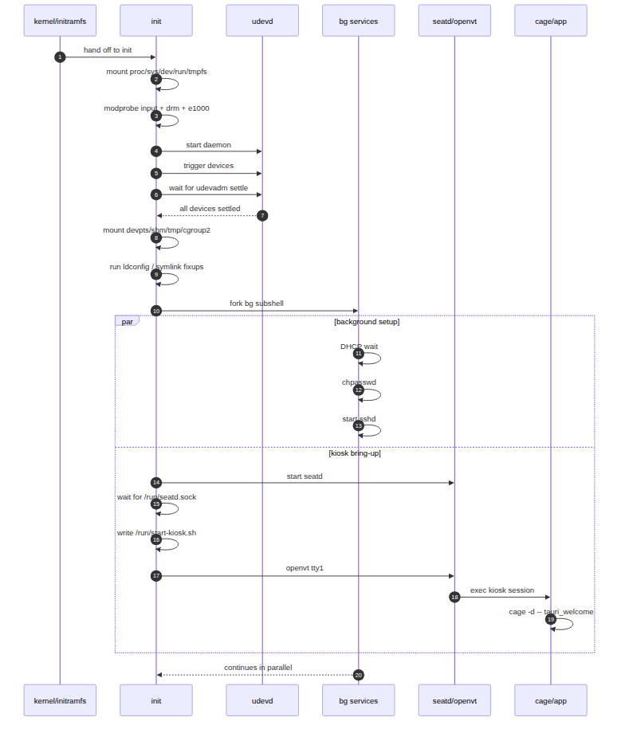

# USB Boot - Alpine Linux Tauri Kiosk

Builds a bootable UEFI USB drive image from Alpine Linux that boots directly into a minimal Wayland kiosk session and launches a Tauri application. The entire OS, kernel, and initramfs are packaged into a single Unified Kernel Image (UKI), so no separate bootloader config is required.

## How It Works

1. **Downloads** Alpine Linux rootfs and runtime packages (kernel, OpenSSH, Wayland/WebKitGTK stack) from the official mirror
2. **Builds** the Tauri app natively inside an Alpine chroot to produce a musl-linked binary
3. **Assembles** a custom initramfs with the rootfs, kernel modules, and an init script
3. **Creates a UKI** (`linux.efi`) containing the kernel + initramfs + boot cmdline via `ukify`
4. **Builds a GPT disk image** with an EFI System Partition containing the UKI as `BOOTX64.EFI`

At boot the init script sets up networking (DHCP), starts SSH (root/alpine), initializes eudev + seatd, starts `cage` on TTY1, then launches `/opt/kiosk/tauri_welcome`.

### Boot sequence



Mermaid source: [doc/bootsequence.mmd](doc/bootsequence.mmd)

Legend:

- `wait:` marks a blocking readiness point in the foreground init path.
- `fork bg subshell` is the main parallelization point: DHCP, password setup, and `sshd` continue in the background.
- `openvt tty1` means the kiosk compositor and the Tauri app are launched on virtual terminal 1, not directly in the init shell.

## Prerequisites

### System packages

Install all build dependencies (Debian/Ubuntu):

```sh
sudo apt install wget tar gzip cpio parted mtools make \
    systemd-ukify systemd-boot-efi python3-pefile \
    qemu-system-x86 ovmf
```

| Package              | apt package         | Used for                                  |
|----------------------|---------------------|-------------------------------------------|
| `wget`               | `wget`              | Downloading Alpine packages               |
| `tar`                | `tar`               | Extracting rootfs and APK archives        |
| `gzip`               | `gzip`              | Compressing initramfs                     |
| `cpio`               | `cpio`              | Creating initramfs cpio archive           |
| `make`               | `make`              | Build automation                          |
| `parted`             | `parted`            | Creating GPT partition table              |
| `mformat` / `mcopy`  | `mtools`            | Creating FAT32 filesystem on disk image   |
| `ukify`              | `systemd-ukify`     | Building Unified Kernel Image             |
| EFI stub             | `systemd-boot-efi`  | Provides `linuxx64.efi.stub` for ukify    |
| `python3-pefile`     | `python3-pefile`    | Python PE file library required by ukify  |
| `qemu-system-x86_64` | `qemu-system-x86`  | Testing the image in a VM                 |
| OVMF                 | `ovmf`              | UEFI firmware for QEMU                    |

KVM support (`/dev/kvm`) is recommended for usable VM performance.

### Kiosk image

Place the image to use as background at `tauri-welcome/src/kiosk-image.png`:

```sh
cp your-image.png tauri-welcome/src/kiosk-image.png
```

This file is used as the background image of the Tauri app and is copied into the initramfs as part of the build pipeline.

## Usage

```sh
sudo make         # build everything (downloads packages on first run)
sudo make run     # test in QEMU (SDL window + serial on stdio)
```

SSH into the running VM:

```sh
ssh root@localhost -p 2222   # password: alpine
```

Write to a real USB drive:

```sh
sudo dd if=bootable-usb.img of=/dev/sdX bs=4M status=progress && sync
```

## Make Targets

| Target              | Description                             |
|---------------------|-----------------------------------------|
| `all` / `disk`      | Build the bootable disk image (default) |
| `download-alpine`   | Download Alpine rootfs and packages     |
| `tauri-build-env`   | Set up the Tauri build chroot (once)    |
| `tauri-build`       | Compile the Tauri app binary            |
| `initramfs`         | Create the initramfs archive            |
| `uki`               | Create the Unified Kernel Image         |
| `run`               | Launch in QEMU                          |
| `clean`             | Remove all build artifacts              |

## Tauri App Build

The kiosk UI is a [Tauri](https://tauri.app/) application compiled natively inside an Alpine Linux chroot so that the resulting binary links against musl libc (matching the initramfs runtime).

The build is split into two stages to avoid repeating the slow environment setup on every code change:

### Stage 1 — environment setup (run once)

Clones `build/alpine` into `build/alpine-build`, installs build dependencies via `apk`, and bootstraps a Rust toolchain via `rustup`. Creates a stamp file `build/alpine-build/.deps-ready` so this step is skipped on subsequent builds.

```sh
sudo make tauri-build-env
```

Re-run this if `TAURI_BUILD_DEPS` changes or you want to rebuild the chroot from scratch.

### Stage 2 — compile (run on every code change)

Copies source files into the existing chroot, runs `npm run build` (frontend), then `cargo build --release` using the rustup-managed toolchain. Verifies the output binary is musl-linked.

```sh
sudo make tauri-build
```

### Common workflows

| Situation | Command |
|-----------|---------|
| First-time build | `sudo make tauri-build-env && sudo make tauri-build` |
| Rust/JS source changed | `sudo make tauri-build` |
| Build deps changed | `sudo make tauri-build-env && sudo make tauri-build` |
| Force full rebuild | `sudo make -B tauri-build-env tauri-build` |
| Full image build | `sudo make disk` *(calls tauri-build automatically)* |

## Project Structure

- `init` — Boot init script (mounts filesystems, networking, SSH, eudev/seatd, cage, Tauri launch)
- `tauri-welcome/src/kiosk-image.png` — Background image for Tauri app, copied into initramfs (**required**, not tracked in git)
- `Makefile` — Full build pipeline
- `build/` — Build outputs (rootfs, initramfs, kernel, UKI)
- `build/tools/alpine-make-rootfs` — Downloaded helper script for building the Alpine rootfs

## Customization

### Rootfs packages

Edit `ROOTFS_PACKAGES` in the `Makefile` to add or remove Alpine packages from the rootfs.

If you change runtime package sets in a way that affects shared libraries or cursor/theme assets, rebuild the cached rootfs to avoid stale cache issues:

```sh
sudo rm -rf build/alpine build/vmlinuz-lts
sudo make repack
```

### Init behavior

Edit `init` to customize boot-time behavior (network, SSH policy, module loading, compositor launch, app command).

Current policy is intentionally VM-oriented and minimal:

- Generic graphics modules: `drm`, `drm_kms_helper`, `simpledrm`, `virtio_gpu`
- Input modules for QEMU/virtio devices
- Root password SSH login enabled for testing

### Rootfs post-install script (`alpine-make-rootfs --script-chroot`)

The build uses [`alpine-make-rootfs`](https://github.com/alpinelinux/alpine-make-rootfs) to assemble the Alpine rootfs. You can pass a script with `--script-chroot` to run commands **inside a chroot of the freshly built rootfs** during the build — for example to configure services with `rc-update`, write config files, or run `apk` commands:

```sh
sudo alpine-make-rootfs --script-chroot --packages "openssh" ./build/alpine ./setup.sh
```

With `--script-chroot` the script runs as if it were running on the target Alpine system. Without it, the script runs on the host with `$ROOTFS` pointing to the rootfs directory.
